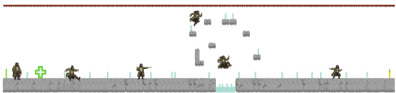
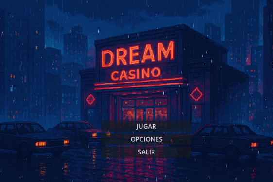

#####
# Game Design Document (GDD)
## Telemática 

### Alumnos:
- **AGUILAR VAZQUEZ JESUS ANGEL**  
- **GERARDO VERGARA CESAR**  
- **ANAYA EVANGELISTA MOISES ALEJANDRO**  
- **BLASQUEZ CHACON DANIEL**  
- **BERMUDEZ PADILLA FRANCISCO JAVIER**  
- **CALVA GARCIA LUIS ARMANDO**  

**Grupo:** 5°G  
**Materia:** PROGRAMACIÓN DE VIDEOJUEGOS  
**Profesor:** RODRIGUEZ ORTIZ MIGUEL ANGEL  

**Fecha:** 17/09/2025  

---

## Índice
1. Sección de género y monetización  
   - Género  
   - Monetización  
   - Benchmarking: *Super Mario World* y *Katana Zero*  
2. Narrativa y ambientación  
3. Diseño de niveles y estructura  
4. Mecánicas de juego  
5. Dificultad y rejugabilidad  
6. Estética y sonido  
7. Progresión y motivación  
8. Usuario objetivo (User Persona)  
9. Encuesta realizada  
10. Resultados de la encuesta  
11. Historia (Escenas y niveles)  
12. Elementos de la historia  
13. Experiencia del jugador  
14. Mecánicas principales  
15. Loop del juego  
16. Prototipo  
17. Mockup Menú  

---

## Sección de género y monetización

### Género
El juego se enmarca dentro del **género de plataformas 2D**, inspirado en clásicos como *Super Mario World*.  
Características:  
- Niveles lineales y progresivos con obstáculos, enemigos y acertijos.  
- Mecánicas centrales: saltar, correr, esquivar, recolectar ítems.  
- Dificultad creciente que motiva la mejora del jugador.  
- Estética retro-moderna, apelando a la nostalgia y a nuevas audiencias.  
- Inclusión de elementos híbridos:  
  - Exploración ligera y rutas alternas.  
  - Coleccionables para incentivar rejugabilidad.  
  - Retos de habilidad para jugadores avanzados.  

### Monetización
Modelo de **pago único (Retail)**:  
- Transparencia total, sin microtransacciones.  
- Alto valor percibido al ofrecer experiencia completa.  
- Evita polémicas con loot boxes y “pay-to-win”.  
- Ingresos directos y seguros por unidad vendida.  

**Riesgos:**  
- Costo inicial puede ser barrera de entrada.  
- Necesidad de estrategia sólida de marketing.  

---

## Benchmarking: *Super Mario World* y *Katana Zero*

### Narrativa y ambientación
- **Katana Zero:** narrativa profunda, tono oscuro y psicológico.  
- **Super Mario World:** personajes carismáticos y reconocibles.  
- **Aplicación al proyecto:** historia oscura sobre deuda y persecución, estética neo-noir y personajes memorables.  

### Diseño de niveles y estructura
- **Super Mario World:** rutas alternativas, secretos, dificultad progresiva.  
- **Katana Zero:** múltiples enfoques (sigilo, acción).  
- **Aplicación al proyecto:** niveles con rutas de escape, combate directo, secretos ligados a la deuda.  

### Mecánicas de juego
- **Katana Zero:** precisión, innovación (tiempo/manipulación).  
- **Super Mario World:** jugabilidad sencilla pero profunda, power-ups.  
- **Aplicación al proyecto:** controles responsivos, mecánica central de “planificación de escapes”, habilidades temporales.  

### Dificultad y rejugabilidad
- **Katana Zero:** rejugabilidad alta, múltiples formas de completar niveles.  
- **Super Mario World:** desafío equilibrado y divertido.  
- **Aplicación al proyecto:** modos de dificultad ajustable, metas secundarias.  

### Estética y sonido
- **Katana Zero:** estilo retro moderno, música inmersiva.  
- **Super Mario World:** estética colorida y amigable.  
- **Aplicación al proyecto:** estética neo-noir con elementos de casino, música jazz oscura/electrónica.  

### Progresión y motivación
- **Katana Zero:** historia inmersiva, progreso constante.  
- **Super Mario World:** metas claras y recompensas inmediatas.  
- **Aplicación al proyecto:** progresión ligada al pago de deuda con medidor visual.  

---

## Usuario objetivo (User Persona)

**Perfil del jugador:**  
- Nombre: Daniel  
- Edad: 21 años  
- Residencia: Colima  
- Ocupación: Estudiante de Ingeniería de Software  
- Plataformas: PC (principal), móvil (ocasional)  
- Tiempo de juego: 8–15 horas semanales  

**Motivaciones:** exploración 100%, encontrar easter eggs, superar retos difíciles, compartir logros.  
**Frustraciones:** controles imprecisos, bugs, dificultad desbalanceada.  
**Objetivos:** completar al 100%, superar retos con exactitud.  
**Frase representativa:** *"No me conformo con pasar el nivel, quiero descubrir todo lo que esconde el juego."*  

---

## Encuesta realizada
Preguntas demográficas (edad, género, plataforma).  
Preguntas sobre hábitos, frustraciones, motivaciones y estética visual.  

### Resultados
- **Demografía:** mayoría entre 18–24 años, principalmente hombres, plataforma PC.  
- **Preferencias:** controles precisos, historia inmersiva, rejugabilidad, niveles con secretos, dificultad equilibrada.  
- **Comportamiento:** buscan completar 100% solo si disfrutan el juego.  
- **Motivaciones:** logros, secretos, buen diseño de niveles.  
- **Estética:** muy valorada como parte de la experiencia.  
- **Socialización:** algunos comparten logros, otros no.  

### Conclusiones
Jugador joven, usuario de PC, enfocado en precisión, historia y rejugabilidad. Valora estética, pero rechaza errores técnicos y repetición.  

---

## Historia (Escenas principales)
- **Escena 1:** Casino decadente, Willy pierde todo y queda endeudado.  
- **Escena 2:** Limbo, neblina, poeta errante.  
- **Escena 3:** Lujuria, barrio rojo, cortesana condenada.  
- **Escena 4:** Gula, banquete podrido, chef eterno.  
- **Escena 5:** Avaricia, rascacielos de oro oxidado, banquero avaro.  
- **Escena 6:** Ira, calles en llamas, boxeador sangrante.  
- **Escena 7:** Herejía, templos derruidos, predicador ciego.  
- **Escena 8:** Violencia, ciudad en guerra, soldado sin rostro.  
- **Escena 9:** Fraude, distrito financiero, abogado corrupto.  
- **Escena 10:** Traición, ciudad congelada, socio traicionado.  
- **Clímax final:** Torre de Dream, enfrentamiento con Satanás.  
- **Final trágico:** Willy condenado a un loop eterno de caída.  

**Mensaje final:** *"La deuda nunca termina."*  

---

## Elementos de la historia
- **Flashbacks:** cinemáticas en tercera persona sobre el pasado de Willy.  
- **Diálogos:** con NPCs claves que impulsan la narrativa.  
- **Cambio de nivel:** a través de flashbacks e interacciones.  

---

## Experiencia del jugador
- Control en tercera persona.  
- Caminar, correr, saltar, deslizarse.  
- Evitar caer del camino.  

---

## Mecánicas principales
- **Combate:** lanzar cartas como arma.  
- **Colección:** recoger monedas.  
- **Daño:** vida reducida al recibir golpes.  
- **Interacción con NPCs:** diálogos e información.  
- **Canje de monedas:** recuperar vida con NPC banquero.  
- **Ítems:** usables estratégicamente.  
- **Misiones:** objetivos para avanzar la historia.  
- **Progresión:** desbloqueo de habilidades.  
- **Reintento:** reinicio de nivel al fallar.  
- **Pausa:** detener el juego.  
- **Vidas:** 3 base, máximo 5.  

---

## Loop del juego 

---

## Prototipo

Primer nivel:  
- Inicio en punto verde.  
- Meta en punto amarillo.  
- Enemigos representados en azul.  
- Ítem de curación representado como “+” verde.  

---

## Mockup Menú
Representación del menú inicial del juego con opciones principales (en construcción).

  
