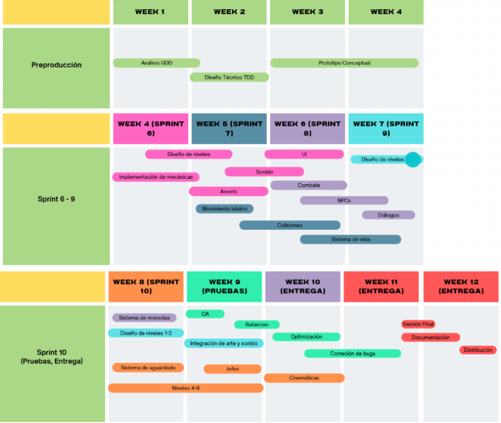
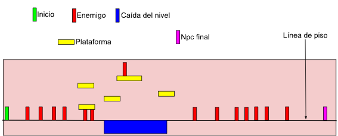
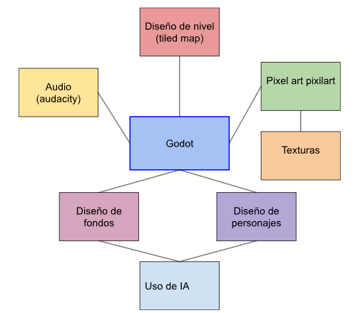
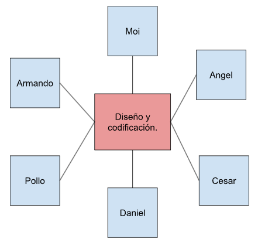
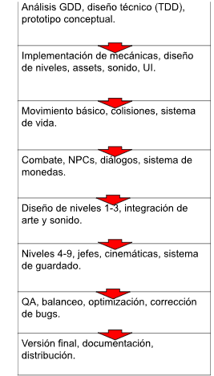

# Technical Design Document (TDD)

## Telemática  

### Alumnos:
- **AGUILAR VAZQUEZ JESUS ANGEL**  
- **GERARDO VERGARA CESAR**  
- **ANAYA EVANGELISTA MOISES ALEJANDRO**  
- **BLASQUEZ CHACON DANIEL**  
- **BERMUDEZ PADILLA FRANCISCO JAVIER**  
- **CALVA GARCIA LUIS ARMANDO**  

**Grupo:** 5°G  
**Materia:** PROGRAMACIÓN DE VIDEOJUEGOS  
**Profesor:** RODRIGUEZ ORTIZ MIGUEL ANGEL  

**Documento:** Game Design Document (GDD)  
**Fecha:** 31/09/2025  

---

## 1. Lista de características obtenidas del GDD
- **Género:** Plataformas 2D con elementos narrativos profundos.  
- **Jugabilidad:** Movimiento lateral, salto, combate con cartas, interacción con NPCs, colección de monedas, sistema de vida y daño.  
- **Narrativa:** Estructura basada en los pecados capitales, con flashbacks y diálogos superpuestos.  
- **Ambientación:** Casino, barrios, torres, estética neo-noir.  
- **HUD:** Vida, monedas, medidor de deuda.  
- **Estilo audiovisual:** 2D retro con ambientación oscura, música jazz-electrónica.  
- **Progresión:** Niveles lineales con secretos, rutas alternativas y jefes finales.  
- **Monetización:** Pago único, sin microtransacciones.  

---

## 2. Elección de Game Engine (Godot)
**Justificación:** Godot es open source, ligero y multiplataforma.  

**Ventajas:**
- Lenguaje **GDScript**: inspirado en Python, rápido de prototipar.  
- Sistema de escenas y nodos: jerarquía modular y reutilizable.  
- **TileMap y TileSet:** construcción rápida de escenarios.  
- **Physics2DServer:** detección de colisiones, cuerpos rígidos y áreas.  
- **AnimationPlayer / AnimationTree:** transiciones de estados.  
- **AudioStreamPlayer:** integración de música dinámica y efectos.  

---

## 3. Planeación (Diagrama de Gantt)

| **Fase**        | **Tareas principales**                                   | **Semanas** |
|-----------------|----------------------------------------------------------|-------------|
| Preproducción   | Análisis GDD, diseño técnico (TDD), prototipo conceptual | 1-4         |
| Sprint 6        | Mecánicas, niveles, assets, sonido, UI                   | 4-6         |
| Sprint 7        | Movimiento básico, colisiones, sistema de vida           | 5-7         |
| Sprint 8        | Combate, NPCs, diálogos, sistema de monedas              | 6-8         |
| Sprint 9        | Diseño de niveles 1-3, arte y sonido                     | 7-9         |
| Sprint 10       | Niveles 4-9, jefes, cinemáticas, guardado                | 8-10        |
| Pruebas         | QA, balanceo, optimización, bugs                         | 9-11        |
| Entrega         | Versión final, documentación, distribución               | 11-12       |

----
#

---
## 4. Diagramas de alto nivel
- **Nivel 1:** Inicio → Enemigo → Caída del nivel → Plataforma → NPC final → Línea de piso.

- **Diagrama de tecnologías:** Godot, Tiled map, Pixel art, Pixilart, IA, Audacity.  

- **Equipo de trabajo:** Ángel, Moi, Daniel, Pollo, Armando, César.  

- **Implementación:** Escenarios, enemigos, NPCs, sistemas de físicas y HUD.  

---

## 5. Herramientas de arte
- **Aseprite:** sprites (personajes, enemigos, ítems).  
- **Pixilart:** diseño pixel art.  
- **IA:** fondos y efectos visuales.  
- **Audacity:** voces y efectos de ambiente.  
- **Godot Particles2D:** fuego, humo, explosiones, luces.  

---

## 6. Objetos 2D, terreno y escenas
- **Escenas:** cada nivel en Godot, con fondos en capas.  
- **Tilemaps:** plataformas y colisiones estáticas.  
- **Sprites:** personajes, enemigos, objetos.  
- **Prefabs:** enemigos, ítems, NPCs instanciables.  

---

## 7. Colisiones, físicas e interacciones
- **Colisiones:** CollisionShape2D en jugador y enemigos.  
- **Físicas:** RigidBody2D para proyectiles/objetos dinámicos.  
- **Interacciones:** Area2D para diálogos, triggers, ítems.  
- **Señales (Signals):** eventos de colisión e interacción.  

---

## 8. Lógica de juego e inteligencia artificial
- **Jugador:** máquina de estados (Idle, Run, Jump, Attack, Hurt).  
- **Enemigos:** patrullaje básico (Path2D), persecución y ataque.  
- **Jefes:** patrones de ataque por scripts.  
- **Flashbacks:** cambios de escena con transiciones.  
- **Sistema de diálogos:** archivos JSON/Resource y señales para activar misiones.  

---

## 9. Networking
El juego es **single-player**.  
No se requiere networking.  

---

## 10. Audio y efectos visuales
- **Audio:**
  - Bosca Ceoil (composición musical).  
  - Audacity (edición de efectos).  
  - Godot Audio Stream Player (integración).  

- **Efectos visuales:**
  - Shaders (GLSL).  
  - Post-processing (Camera2D).  
  - Animaciones (Animation Player & Animation Tree).  

---

## 11. Plataforma y requerimientos de software

**Plataforma destino:** PC (Windows/Linux).  

**Requisitos mínimos:**
- CPU: Intel i3 / Ryzen 3.  
- RAM: 4 GB.  
- GPU: Integrada (Intel UHD / AMD Vega).  
- Almacenamiento: 4 GB.  

**Software:**
- Godot 4.x  
- Aseprite / Krita  
- Audacity  

**Hardware:**
- Teclado  
- Mouse  
- Monitor  
- Altavoces / Auriculares  
